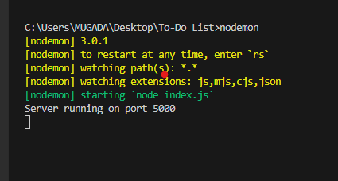
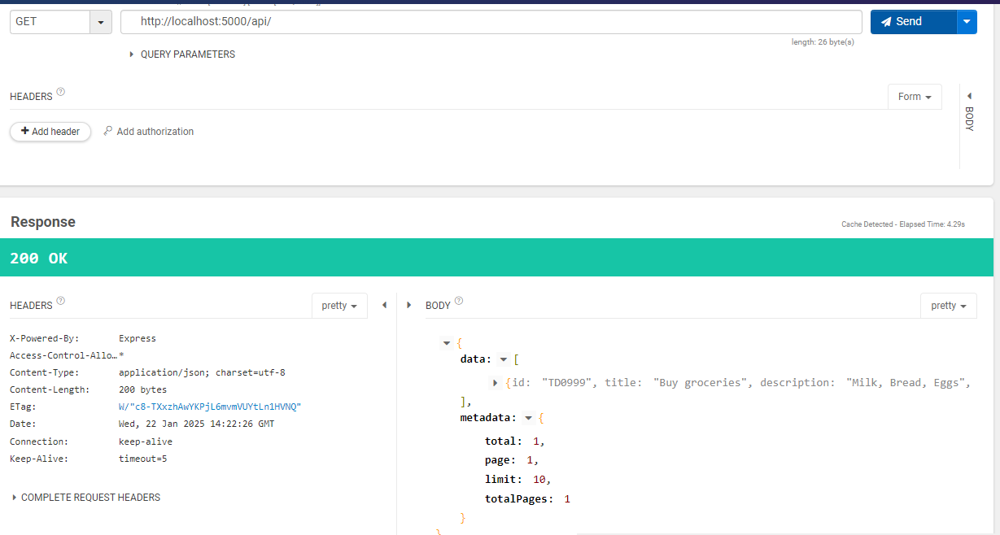
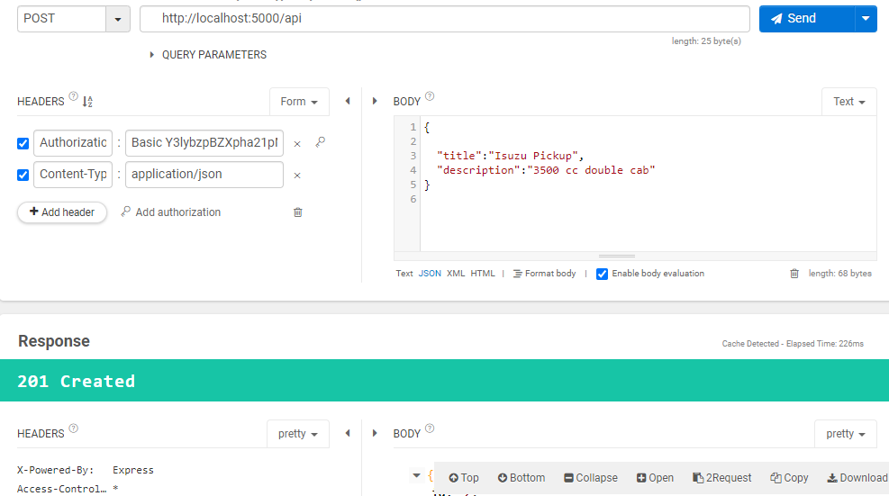
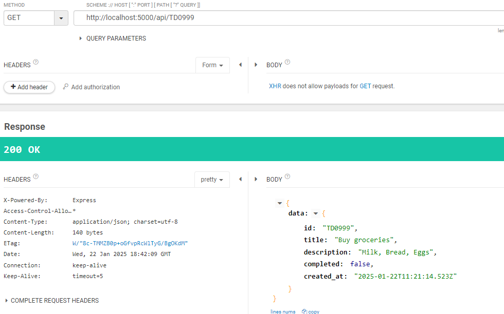
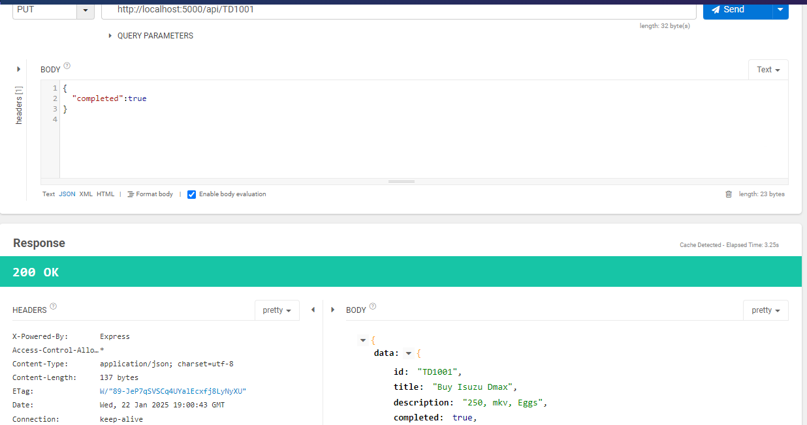
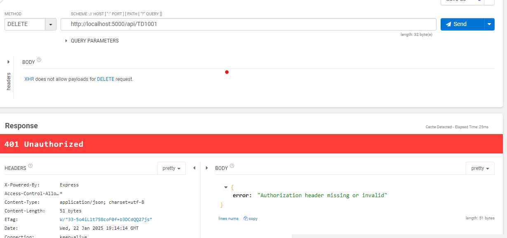
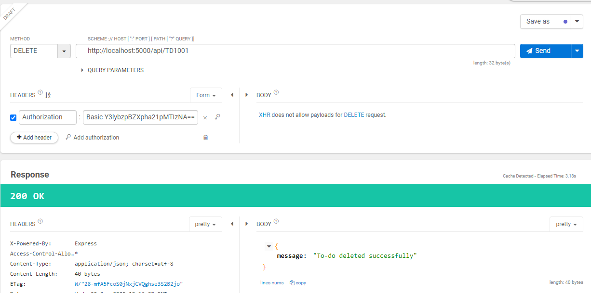

<h2 align="center">CYRIL MUGADA<h2><h3 align="center">To-do list </h3>
<p align="center"> Nodejs project for a todo list using Sqlite as the Databse for easy Deployment and testing<br> </p>


## About <a name = "about"></a>
A simple Implementation of the Todo List.

## Getting Started <a name = "getting_started"></a>

These instructions will get you a copy of the project up and running on your local machine for development and testing purposes. 

### Prerequisites

First Clone The project to you local repository.
```
git clone https://github.com/mugash75/To-Do-List.git
```

What things you need to install the software and how to install them in package Json.
```
npm list
to-do-list@1.0.0 C:\Users\MUGADA\Desktop\To-Do List
├── body-parser@1.20.3
├── cors@2.8.5
├── dotenv@16.4.7
├── express-flash@0.0.2
├── express-validator@7.2.1
├── express@4.21.2
├── nodemon@3.1.9
├── sqlite3@5.1.7
└── uuid@11.0.5
```

### Installing

A step by step series of examples that tell you how to get a development env running.

Just Run this it will install the package.json packages then start server
```
npm install
nodemon or npm start
```
<p align="center">
  <a href="" rel="noopener">
 </a>
</p>

## 🔧 Running the tests <a name = "tests"></a>

The System is easy and runs through routes then controllers.
### Run DB initialization Sqlite (only if temp.sqlite is not in the cloned folder)
Initilize DB and Table(GET) 
```
http://localhost:7500/api/todo/setupdb

sample params

?completed=true&page=1&limit=10&search="dmax"

```

<p align="center">
  <a href="" rel="noopener">
 </a>
</p>

insert a todo (POST) 
```
http://localhost:7500/api/

sample body

{
  "title":"Isuzu Dmax 3750cc",
  "description":"Buy a double cab,kubeba Simiti"
}
```
<p align="center">
  <a href="" rel="noopener">
 </a>
</p>

get all todo list (GET) 
```
http://localhost:7500/api/
```
<p align="center">
  <a href="" rel="noopener">
 </a>
</p>

get all todo list (GET)  specific
```
http://localhost:7500/api/ccea71d6-5a47-4985-973a-9d5ec1f47ad9
```
<p align="center">
  <a href="" rel="noopener">
 </a>
</p>


Update the values (PUT) 
```
http://localhost:7500/api/ccea71d6-5a47-4985-973a-9d5ec1f47ad9

sample body
{
  "completed":true
}
```

<p align="center">
  <a href="" rel="noopener">
 </a>
</p>

delete  
// this Route is Auth protected using Basic Auth (DELETE)

```
use auth header

username=cyro
password=Aezakmi1234

http://localhost:7500/api
```
<p align="center">
  <a href="" rel="noopener">
 </a>
</p>
<p align="center">
  <a href="" rel="noopener">
 </a>
</p>


## ⛏️ Built Using <a name = "built_using"></a>

- [Sqlite](https://www.sqlite.org/) - Database
- [Express](https://expressjs.com/) - Server Framework
- [NodeJs](https://nodejs.org/en/) - Server Environment

## ✍️ Authors <a name = "authors"></a>

- [@Cyril Mugada](https://github.com/mugash75) - Idea & Initial work.
